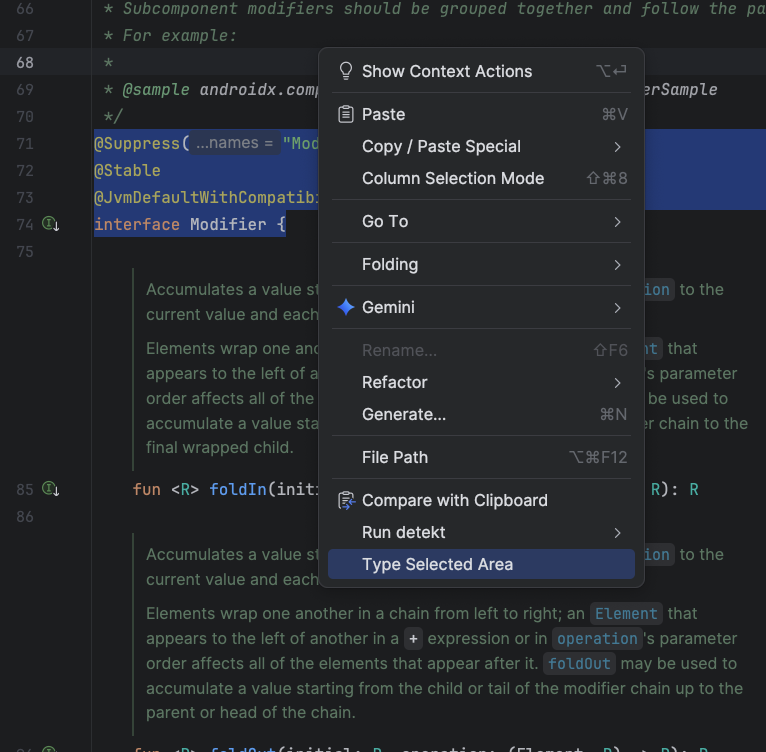
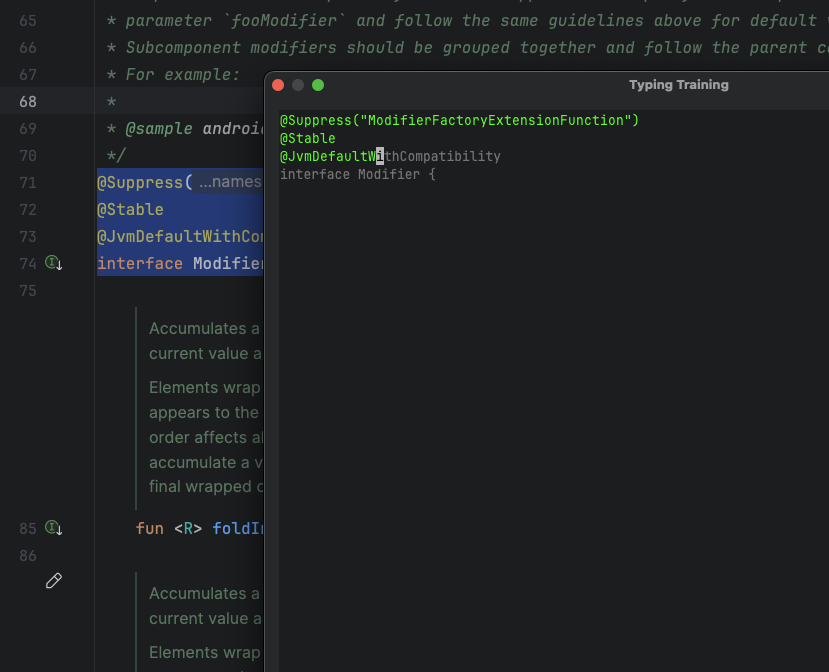
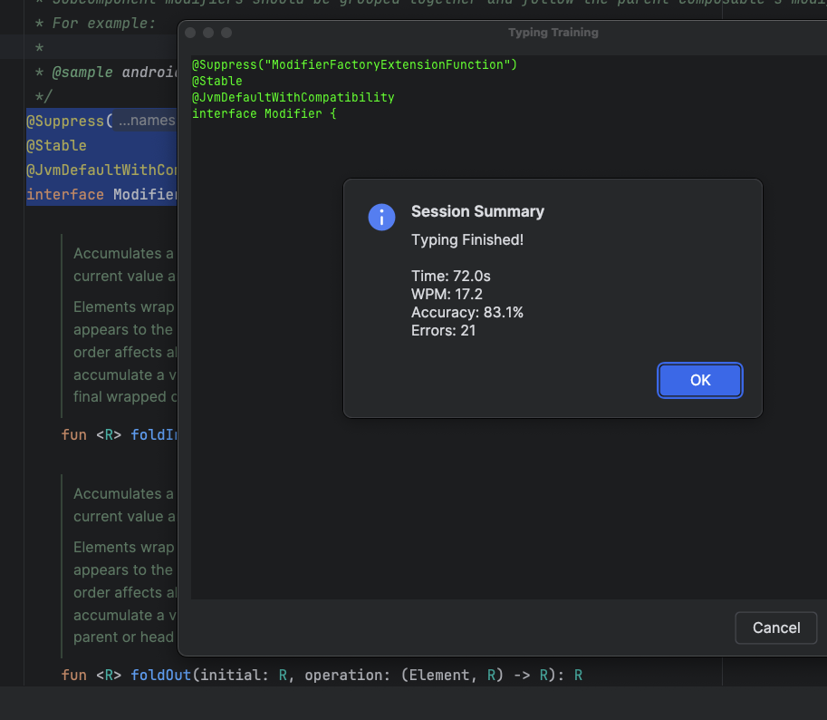

# Typing Training Plugin for IntelliJ IDEA

Master the art of coding at the speed of thought.

While many developers focus on learning new frameworks and languages, the fundamental skill of touch typing is often overlooked. This plugin brings deliberate typing practice directly into your IDE, allowing you to train on the very code you work with every day.

## Features

- **Real-World Practice:** Type entire source files or specific selected blocks to build muscle memory for syntax and common patterns.
- **Code Familiarity:** Practice on your own project's codebase to internalize its structure.
- **Seamless Integration:** Start a session with a simple right-click in your editor.
- **Instant Feedback:** Real-time highlighting of errors and a detailed summary of your speed (WPM) and accuracy.

## Screenshots

### Start Typing
Right-click in any editor to start typing the whole file or a selected area.

### Practice Mode
Type over the ghost text. Correct characters turn green, errors turn red.

### Statistics
Get detailed feedback on your performance at the end of each session.

## Installation

1. Open IntelliJ IDEA.
2. Go to `Settings` > `Plugins`.
3. Search for "Typing Training" in the Marketplace (Coming Soon).
4. Click `Install`.

## How to Use

1. Open any source file in your IDE.
2. (Optional) Select a specific block of code you want to practice.
3. Right-click and select **"Type This Class"** or **"Type Selected Area"**.
4. Start typing!

## Contributing

We welcome contributions to make this the best typing trainer for developers!

### How to Contribute:
1. **Fork** the repository.
2. **Clone** your fork: `git clone https://github.com/Kiolk/TypingPlugin.git`
3. Create a **Feature Branch**: `git checkout -b feature/amazing-feature`
4. **Build** the project using Gradle: `./gradlew build`
5. **Test** your changes in a sandbox IDE: `./gradlew runIde`
6. **Commit** your changes: `git commit -m 'Add amazing feature'`
7. **Push** to the branch: `git push origin feature/amazing-feature`
8. Open a **Pull Request**.

### Development Requirements:
- JDK 17
- IntelliJ IDEA (Community or Ultimate)

## License
Distributed under the MIT License. See `LICENSE` for more information.

---
*Created by [Yauheni Slizh](https://github.com/Kiolk)*
